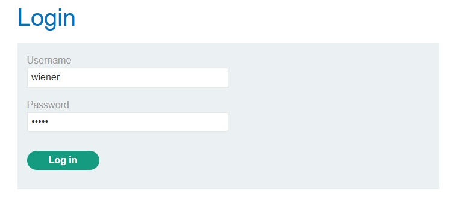
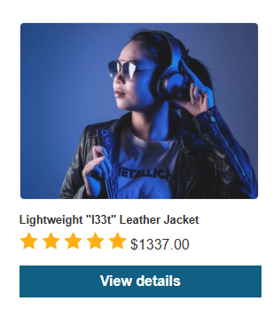
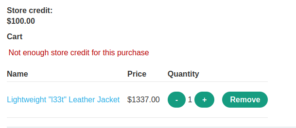
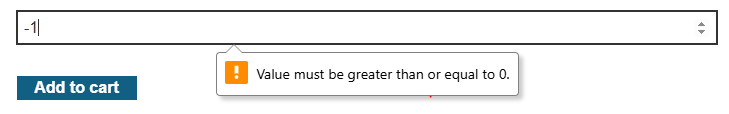
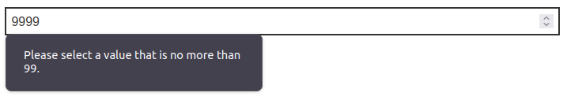
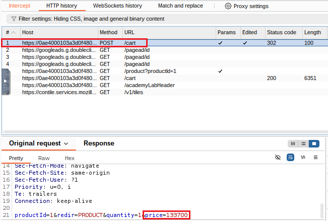
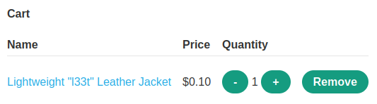
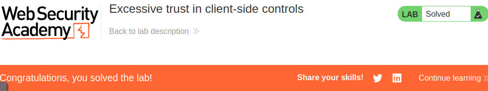

# Excessive trust in client-side controls - Portswigger

## 1. Executive Summary
- Vulnerability: Lỗi logic trong chức năng giỏ hàng.
- Severity: Medium (Trung bình)
- Description: Ứng dụng tin tưởng data giả từ client, cho phép phao tác để mua sản phẩm với giá thấp ($0.10), vượt qua kiểm tra server-side.

## 2. Technical Description
- URL: `https://0a3e00d6035d35cd807dd08b00b20011.web-security-academy.net/`
- Discovery:
  1. Đăng nhập vào login form với account: `wiener:peter`
  

  2. Truy cập sản phẩm: "Lightweight "I33t" Leather Jacket"
  

  3. Thử đặt hàng nhưng nhận lỗi "Not enough store credit for this purchase" vì Store credit chỉ có $100.00
  

- Exploitation:
  1. Thao tác số lượng:
    - Payload: `quantity=-1` trong form giỏ hàng
    - Result: Pop-up lỗi "Value must be greater than or equal to 0".
    

    - Payload: `quantity=9999` trong form giỏ hàng
    - Result: Pop-up lỗi "Please select a value that is no more than 99".
    
  
  2. Thao tác giá
    - Bắt POST request `/cart` bằng Burp Proxy -> HTTP History
    - Chi tiết request: `productId`, `redir`, `quantity`, `price`.
    

    - Sửa trong Burp Repeater: `price=10`.
    - Result: GET request tới `/cart` cho thấy giá sản phẩm thay đổi thành $0.10.
    

  3. Đặt hàng
    - Gửi đơn hàng với giá đã sửa ($0.10).
    - Result: Nhận thông báo "Your order is on its way", xác nhận hoàn thành lab.
    

## 3. Impact
- Gây thiệt hại tài chính do mua sản phẩm giá trị cao với chi phí tối thiểu ($0.10).
- Có thể bị lạm dụng rộng trong các ứng dụng e-commerce tin tưởng data client-side.

## 4. Recommendations
- Thực hiện kiểm tra server-side cho giá và số lượng (so sánh với giá trong database).
- Sử dụng cơ chế chống giả mạo (VD: mã hóa giá trị client-side).
- Giới hạn số lượng trong khoảng hợp lệ (số dương, nhỏ hơn tồn kho).
