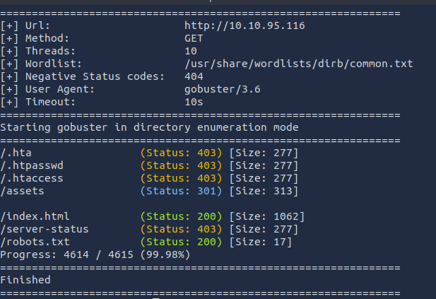
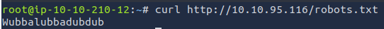
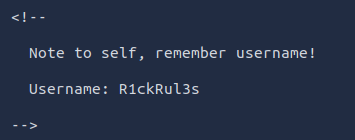
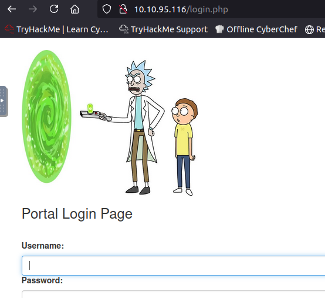
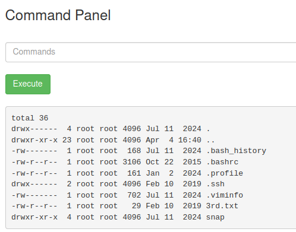

# Picke Rick

## Overview
- **Difficulty**: Easy
- **Platform**: TryHackMe
- **Link**: [Pickle Rick](https://tryhackme.com/room/picklerick)
- **Goal**: Tìm 3 flag thông qua web exploration và command execution.

## Steps
1. **Reconnaissance**
- Dùng `gobuster` scan target (`10.10.x.x`) để liệt kê các thư mục có tồn tại: `gobuster dir -u http://vulnnet.thm -w /usr/share/wordlists/dirb/common.txt`

- Phát hiện được `robots.txt` và `index.html`
  + Trong `robots.txt` tìm được password: `Wubbalubbadubdub`
    
  + Trong `index.html` tìm được username: `R1ckRul3s`
    
    
2. **Login**:
- Truy cập `http://10.10.x.x/login.php`

- Thử dùng username & password vừa tìm log in vào `login.php` thì thành công.
- Và thấy command pane.

3. **Flag Hunting**:
- **Flag 1**:
