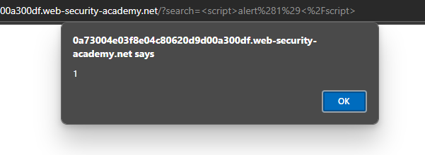

# Reflected XSS - Easy Labs (PortSwigger)

## Lab 1: Reflected XSS into HTML context with nothing encoded
### Steps
- Search box hiện ngay đầu trang web
- Nhập payload `` vào search box.
- Nhấn submit để kiểm tra XSS.

### Findings
- Payload: ``
- Result: Pop-up alert "1" => Xác nhận XSS vuln, không cần mã hóa input.

## Impact (Common for all Easy labs)
- Có thể trộm cookie hoặc thực thi mã độc JS.

## Recommendations (Common for all Easy labs)
- Lọc input (`<`, `>`).
